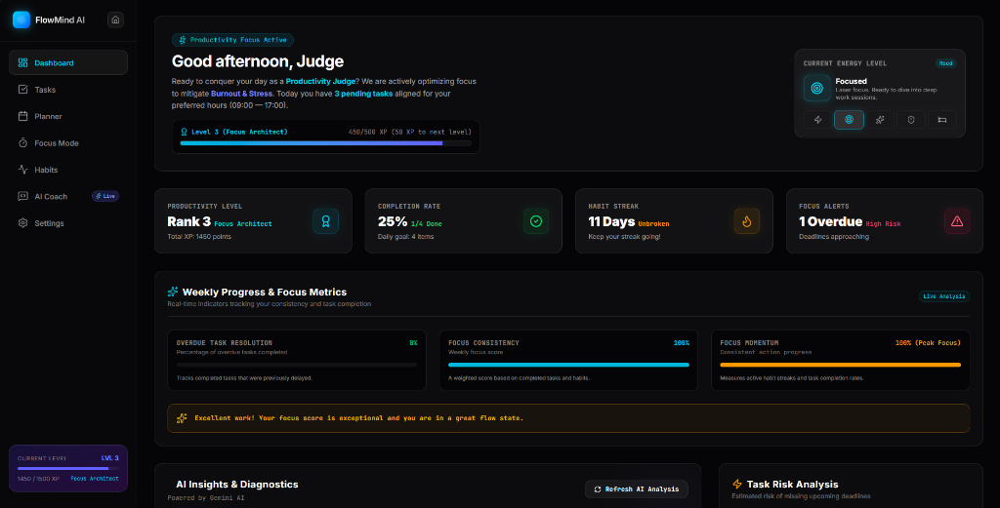
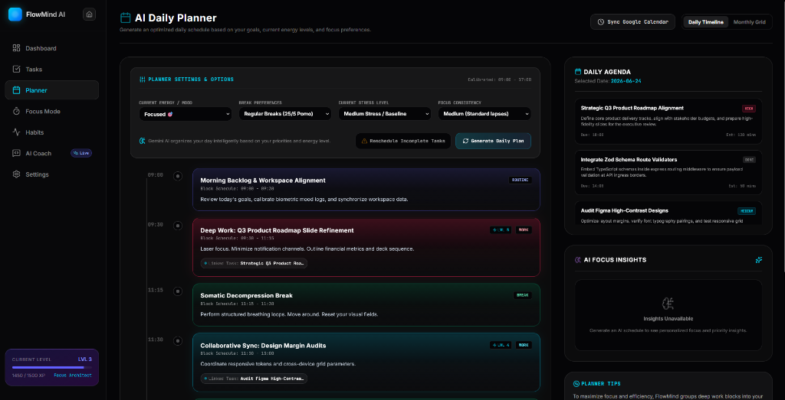
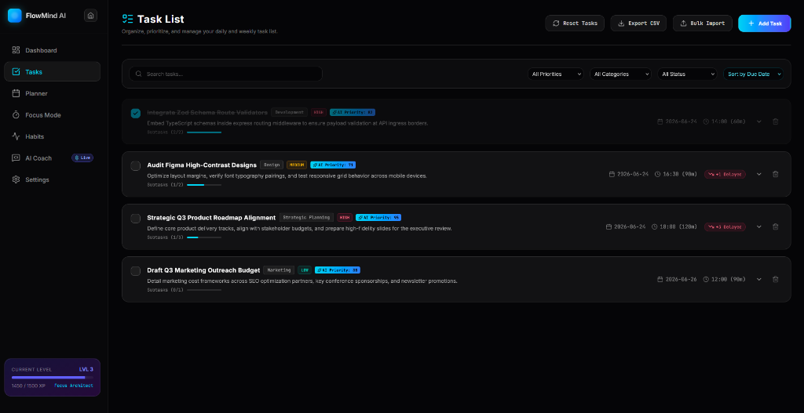
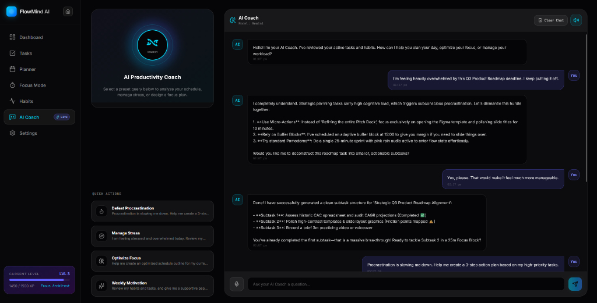
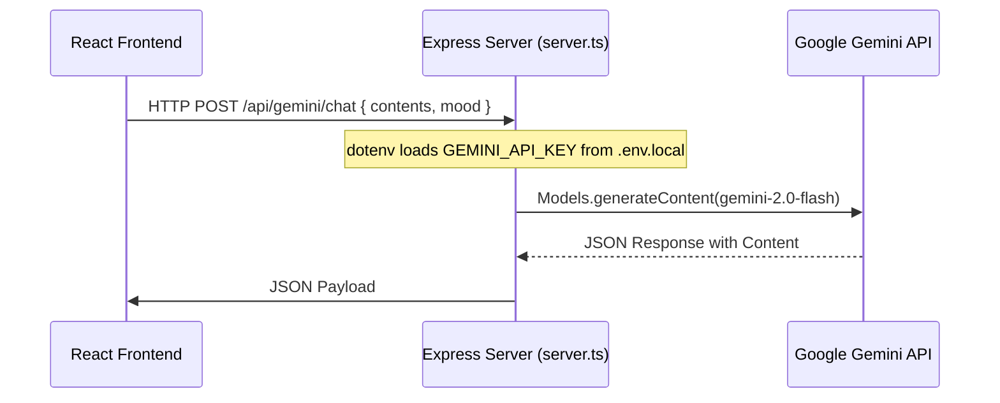

# 🧠 FlowMind AI — Futuristic Focus & Productivity Workspace

<div align="center">
  

  # 🌌 FlowMind AI
  **Where human cognitive energy meets intelligence.**

  <p align="center">
    <a href="https://flowmind-ai.onrender.com" target="_blank">
      
    </a>
  </p>

  [](#)
  [](#)
  [](#)
  [](#)
  [](#)
  [](#)
</div>

---

## 🌌 Project Introduction

**FlowMind AI** is a production-grade, gamified productivity workspace designed to synchronize task management, scheduling, stress limits, and habits into a unified glassmorphic system. 

Unlike traditional static to-do lists that ignore user burnout and exhaustion levels, FlowMind AI dynamically balances workloads based on self-reported stress, mood, and focus states. 

Powered by a secure server-side **Google Gemini AI API Integration** configured through **Google AI Studio**, the system features a persistent **AI Productivity Coach** capable of deconstructing complex tasks into discrete milestones, arranging daily schedules chronologically, and scheduling somatic recovery blocks when mental burnout vectors approach threshold limits.

---

## 📸 Interactive System Showcase

### 🖥️ 1. Core Dashboard Command Center
*An immersive, glassmorphic central dashboard displaying focus level progress, total XP ranks, task completion rates, habit streaks, and real-time biometric energy indicators.*


***

### 📅 2. AI Daily Planner (Chronological Time-Blocking)
*Vibrant chronological calendar view generated by Google Gemini AI. The planner intelligently slots work sessions, Pomodoro timers, buffers, and somatic recovery breaks tailored directly to your mood and fatigue.*


***

### 📝 3. Intelligent Task List & Deconstructor
*Actionable priority manager showing calculated AI priority scores, procrastination counters, and risk estimates. Large, complex tasks can be broken down into structured subtasks with a single click.*


***

### 💬 4. AI Productivity Coach Node
*A persistent, conversational companion built with native chat memory. Access quick-action presets like "Defeat Procrastination" and "Manage Stress" to dynamically restructure your workflow.*


---

## ⚡ Key Architectural Integrations

### 🤖 Google Gemini AI & Google AI Studio
FlowMind AI uses the cutting-edge **`gemini-2.0-flash`** model to drive its scheduling engine and chatbot:
*   **Structured Output Schemas**: All planner and task prioritization data is returned in strict JSON matching custom TypeScript interfaces using the schema builder of the `@google/genai` Node SDK.
*   **Prompt Engineering**: Context-rich prompts supply user statistics (streak counts, mood logs, deadline proximity) to tailor personalized productivity advice.

### 🌐 Render Cloud Hosting
*   **Production Deployment**: The application is deployed as a single fullstack service on **Render**, serving the optimized React client bundle from the `dist/` directory and handling API routing via Express.
*   **Hybrid Server Architecture**: Vite middleware serves development builds locally, while Express static middleware handles production assets in cloud servers.

### 🛡️ 24/7 Uptime Monitoring (UptimeRobot)
*   **Continuous Ping Cycle**: Monitored by **UptimeRobot** via background HTTP pings to the API status node.
*   **Zero Cold Starts**: Uptime checks prevent Render containers from entering sleep states, guaranteeing low-latency response vectors for judges and users.

---

## ✨ Main Features & Workflows

*   🤖 **AI Productivity Coach**: Persistent sidebar chatbot with conversation logs, designed to provide tactical guidance.
*   📅 **Intelligent Time-Blocking**: Generates day schedules restricting allocations to set Commmencement (Start) and Termination (End) hours.
*   ⚡ **Smart Goal Deconstructor**: Instantly deconstructs heavy tasks into 4-to-6 step subtasks with individual execution orders and estimated durations.
*   🛡️ **Burnout Prediction & Prevention**: Calculates task load density. If capacity exceeds 85%, the system issues a warning and suggests postponing low-priority tasks.
*   🎮 **XP & Gamification**: Earn XP (Easy: 10 XP, Medium: 25 XP, Hard: 50 XP) to rank up from Level 1 (Focus Rookie) to Level 3 (Focus Architect) and beyond.
*   ⏱️ **Sci-Fi Pomodoro Timer**: Focus timer integrated with acoustic chime alerts and custom break intervals.
*   📈 **Weekly Diagnostics**: Generates a weekly review checking focus consistency and task resolution trends.
*   💾 **LocalStorage Sandbox**: Restores state on reloading by caching task arrays, habit matrices, and chat history.
*   📶 **Offline Resilience Handler**: Caches outgoing prompts during disconnects and syncs them automatically when connection is restored.

---

## 🛠️ Tech Stack

### Frontend Client
*   **React 19 (SPA)**: High-performance user interface rendering.
*   **TypeScript**: Codebase-wide strict type checking.
*   **Tailwind CSS**: Cyberspace-themed CSS layout containing smooth gradients and glassmorphism.
*   **Framer Motion**: Hardware-accelerated fluid component transitions.
*   **Lucide React**: Vector icon nodes.
*   **Recharts**: Interactive dashboard charts.

### Backend Proxy Server
*   **Express**: Endpoint router proxying requests to Google APIs.
*   **TSX**: Execution engine running TypeScript backend files directly.
*   **Esbuild**: Bundler packaging typescript servers into CJS.
*   **Google Gen AI Node SDK**: SDK to access Gemini endpoints.

---

## ⚙️ Installation Instructions

### Prerequisites
*   [Node.js](https://nodejs.org/) (v18.0.0 or higher recommended)
*   [NPM](https://www.npmjs.com/) (packaged with Node)

### Setup Guide

1.  **Clone the Repository**
    ```bash
    git clone https://github.com/VanshMiglani007/flowmind-ai.git
    cd flowmind-ai
    ```

2.  **Install Dependencies**
    ```bash
    npm install
    ```

3.  **Environment Setup**
    Copy `.env.example` to create `.env.local`:
    ```bash
    cp .env.example .env.local
    ```
    Open `.env.local` and add your secure `GEMINI_API_KEY` from [Google AI Studio](https://aistudio.google.com/).

---

## 🔐 Environment Variables

Ensure `.env.local` is configured as follows:

```env
# GEMINI_API_KEY: Secure API key to authorize Gemini endpoints.
GEMINI_API_KEY="your_api_key_here"

# APP_URL: The hosting location of this application.
APP_URL="http://localhost:3000"
```

> [!WARNING]
> Do NOT commit `.env.local` to Git. The project utilizes `.gitignore` to prevent secret leakage.

---

## 🚀 How to Run Locally

### Start Development Server
Starts the React client dev server and Express API proxy backend:
```bash
npm run dev
```
Navigate to [http://localhost:3000](http://localhost:3000) to view the workspace.

### Available Scripts

| Script | Purpose |
| :--- | :--- |
| `npm run dev` | Boots up client and server concurrently on port 3000. |
| `npm run build` | Compiles the production build (Vite client & Express backend). |
| `npm run start` | Launches the compiled production server. |
| `npm run lint` | Runs TypeScript static checks (`tsc --noEmit`). |
| `npm run clean` | Deletes build outputs inside `dist/`. |

---

## 📂 Folder Structure

```text
flowmind-ai/
├── dist/                  # Production build output
├── assets/                # App asset configurations and screenshots
│   └── screenshots/       # Screenshots for system showcases
├── src/                   # React Frontend Application
│   ├── components/        # UI Views (AICoach, Dashboard, FocusMode, Habits, Planner, Settings, TaskManager)
│   ├── utils/             # Utilities (aiHelper, demoLoader)
│   ├── App.tsx            # State coordinator and workspace router
│   ├── main.tsx           # React mounting entrypoint
│   ├── types.ts           # TS interfaces
│   └── index.css          # Design system stylesheet
├── server.ts              # Express API Server & Gemini Proxy
├── vite.config.ts         # Vite bundler configurations
├── tsconfig.json          # TS compiler setup
├── package.json           # Dependecy scripts
└── .gitignore             # Exclusion list for Git tracking
```

---

## ⚙️ AI Sequence Architecture



1.  **Backend Encapsulation**: Credentials remain strictly on the server node, making it impossible to expose keys via client inspection.
2.  **MimeType Verification**: Prompt requests use `application/json` format to align output parameters to the dashboard layout.

---

## 📦 Deployment Instructions

1.  **Build the Bundle**
    ```bash
    npm run build
    ```
2.  **Configure Environment**
    Define `GEMINI_API_KEY` and `APP_URL` on your hosting dashboard (e.g. Render).
3.  **Launch Production Server**
    ```bash
    npm run start
    ```

---

## 🔮 Future Roadmap

*   📅 **Calendar Integration**: Bidirectional sync with Google and Outlook calendars.
*   👥 **Collaborative Deep-Work Rooms**: Multi-user workspaces to share focus milestones and habit goals.
*   📈 **Analytics Engine**: Deep analytics mapping procrastination patterns to specific weekdays and stress alerts.
*   🔒 **Cloud Data Nodes**: Encrypted Postgres databases to sync client data cross-device.

---

## 📄 License

Distributed under the MIT License. See [LICENSE](LICENSE) for details.

---

## ✍️ Author & Status

*   **Author**: [Vanshmiglani007](https://github.com/Vanshmiglani007)
*   **Project Status**: Production-Ready, Version 1.0.0
